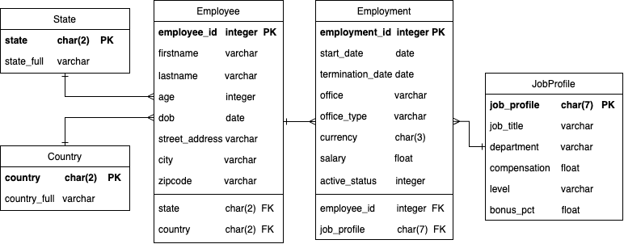

# HR-Data-ETL-Pipeline

The objective of this project is to design and implement a simple ETL (Extract, Transform, Load) pipeline that automates the processing of human resources data from multiple text files, transforms the data according to schemas constraints, and loads it into a **PostgreSQL** database. The workflow is automated and scheduled daily using **Apache Airflow** with **Python** and **SQL** scripts. 
  
## Environment preparation

- This project uses **Apache Airflow** running via **Docker**. To get started, download the [Docker compose file](https://airflow.apache.org/docs/apache-airflow/2.9.1/docker-compose.yaml) to the project directory, and run the following command.

```
docker compose up
```
- **PostgreSQL** serves as the project's database management system. The database named *hrdb* was primarily created and hosted locally. To perform the loading process, configuring the connection between **PostgreSQL** and **Apache Airflow** within the Airflow environment is necessary. To set up the connection between Apache Airflow and PostgreSQL, specify the following details: Connection id, Connection type: *postgres*, host, schema: *hrdb*, login, password, and port: *5432*. These details will not only establish the connection within Apache Airflow but also serve as references for establishing the connection in Python scripts.

## Dataset
Two text files containing human resources data were obtained from [this GitHub repository](https://github.com/Koluit/The_Company_Data.git). Below are the details of the columns extracted from two text files:

**1. CompanyData.txt**
<br> Columns: EmployeeID, First_Name, Surname, StreetAddress, City, State, StateFull, ZipCode, Country, CountryFull, Age, Office, Start_Date, Termination_Date, Office_Type, Department, Currency, Bonus_pct, Job_title, DOB, level, Salary, Active, Status, Job_Profile, Notes

**2. 2021.06_job_profile_mapping.txt**
<br> Columns: Department, Job_title, Job_Profile, Compensation, Level, Bonus %

## Data model
Based on the raw data, an entiry relationship diagram was designed to ensure optimal organization and efficiency in data retrieval and analysis. The schema is depicted below:

<br><br>  <br>

**1. Fact table**
- Employment: This table stores comprehensive employment details of employees. It captures the history of an employee's association with a company. The employment ID was generated, in case the employee might change or have several positions within the organization. Additionally, this table is connected to the Employee and JobProfile tables via foreign keys.
  
**2. Dimension tables**
- Employee: This table contains personal and demographic information for each employee. The state and country names are stored only in abbreviated forms and connected to the State and Country tables via foreign keys.
- State: This table contains state names in both abbreviated and full forms.
- Country: This table contains country names in both abbreviated and full forms.
- JobProfile: This table provides details about each job profile, including job titles, department, and other relevant attributes.

## Extract-Transform-Load
**1. Extract**
- The initial step involved extracting text files and converting them into .csv format using the BashOperator in Apache Airflow.
- [Extraction script](dags/exteact.py).

**2. Transform**
- After extraction, the transformation process was executed using the PythonOperator.
- This step focused on eliminating duplications and rearranging the columns of each table to match the designed schema.
- [Detailed data transformation process](dags/transform_load.py).

**3. Load**
- Once the data was transformed, it was ready to be loaded into the PostgreSQL database.
- The PostgresHook was utilized to manage database connections and operations.
- Python scripts established the connection and executed SQL commands to load the .csv files into the database.
- The SQL script, which includes table creation and data loading commands, ensures that the data adheres to the specified schema and constraints, thereby maintaining data integrity and consistency.
- This made HR-related data stored and readily accessible for analysis and reporting purposes.
- [Detailed data loading process](dags/transform_load.py), with [SQL script](dags/load_data.sql).

## Future works
- Enhance pipeline automation between extract, transform, and load tasks to improve efficiency and streamline data processing workflows.
- Conduct more comprehensive data cleaning, and perform in-depth data analysis.
- Connect the database with BI tools, and create insightful visualizations.


